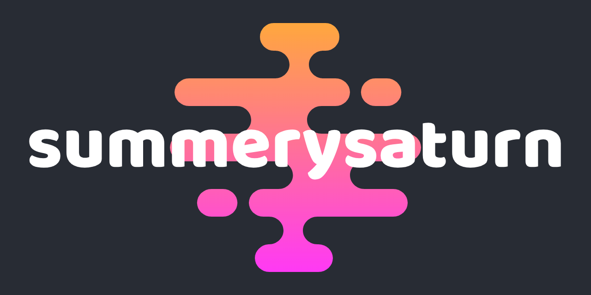

This is my personal website, hosted through Github pages, utilising react and react-bootstrap. Effectively a portfolio/CV as well as a hub for my contact information and social media accounts.

## Deployment & Development

In the project directory, you can run:

### `npm start`

Runs the app in the development mode. 
Open [http://localhost:3000](http://localhost:3000) to view it in the browser.

The page will reload if you make edits. 
You will also see any lint errors in the console.

### `npm run build`

Builds the app for production to the `build` folder. 
It correctly bundles React in production mode and optimizes the build for the best performance.

The build is minified and the filenames include the hashes. 
Your app is ready to be deployed!

See the section about [deployment](https://facebook.github.io/create-react-app/docs/deployment) for more information.

### `npm run deploy`

This command builds, just the same as `npm run build`, except also publishing it to github pages. The URL is written in `package.json`, and should be replaced if you're cloning/forking.
